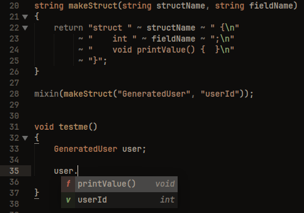

# IMPORTANT

This is a **proof-of-concept (POC)** project. Its primary purpose is to research the feasibility of building a D language server directly on top of the `dmd` frontend, using `dmd`'s semantic analysis as a library.

The ultimate goal is **not** to ship this POC as-is, but to use the results and experience gained here to produce a cleaned-up, production-ready implementation suitable for inclusion in `dmd` itself.

If you are looking for something more stable, check out my other LSP project: [dls](https://github.com/xoxorwr/dls).


# dmd-lsp

A minimal, dmd-frontend-native language server for D. Diagnostics, completion,
signature help and lint run on real `dmd` semantic, used read-only as a
library — no DCD, no libdparse heuristics.



## Features

- **Full D**: analysis *is* dmd's own semantic (used as a library), so
  templates, `mixin`, CTFE, `__traits` and every other language feature work —
  not a subset.
- **Diagnostics** from real dmd semantic, plus lint for unused imports and
  unused parameters.
- **Completion** with semantic types, locals and imports; LSP 3.17
  `labelDetails`.
- **Signature help**, **goto definition**, **hover** (type + docs).
- **Code actions** (remove unused import).
- **Semantic tokens** — identifier-level highlighting.

Supported LSP methods:

- lifecycle: `initialize`, `initialized`, `shutdown`, `exit`
- sync: `textDocument/didOpen`, `didChange`, `didClose`, `didSave`
- completion: `textDocument/completion` (LSP 3.17 `labelDetails` when opted in)
- signature help: `textDocument/signatureHelp`
- goto definition: `textDocument/definition`
- references: `textDocument/references`
- rename: `textDocument/prepareRename`, `textDocument/rename`
- document symbols: `textDocument/documentSymbol`
- workspace symbols: `workspace/symbol`
- hover: `textDocument/hover` (type + docs)
- code action: `textDocument/codeAction` (remove unused import)
- semantic highlighting: `textDocument/semanticTokens/full`
- diagnostics: `textDocument/publishDiagnostics`

## Build

```sh
make            # -> ./dmd-lsp, from the vendored src/dmd/
make DC=ldmd2   # same, with LDC's dmd-compatible driver (smaller binary)
make check      # struct-only guard + batch fixtures + LSP regression suite
make vscode     # compile the VS Code extension (tsc + esbuild)
make vsix       # package it -> editor/vscode/dmd-lsp.vsix
```

Needs a D compiler (DMD 2.113 line, or LDC ≥ 1.42 whose frontend covers it).
The dmd frontend is vendored under `src/dmd/` so the build is self-contained;
refresh it with `make vendor` — see [docs/vendoring.md](docs/vendoring.md).

## Usage

### VS Code
Install `dmd-lsp.vsix` from the
[nightly release](https://github.com/xoxorwr/dmd-lsp/releases/tag/nightly)
(or build it with `make vsix`). On first activation the extension downloads the
server for your platform and keeps it updated. Settings:

- `dmdLsp.serverPath` — use a local build instead of the downloaded binary.
- `dmdLsp.autoUpdate` — re-download when the nightly changes (default `true`).
- **dmd-lsp: Create dls.json** — write a starter config (see [Configuration](#configuration)).

### Other editors
Download the standalone binary for your platform from the
[nightly release](https://github.com/xoxorwr/dmd-lsp/releases/tag/nightly)
(with `SHA256SUMS`), or build it above:

- `dmd-lsp-linux-x64.tar.gz`
- `dmd-lsp-darwin-arm64.tar.gz`
- `dmd-lsp-darwin-x64.tar.gz`
- `dmd-lsp-win-x64.zip` (`dmd-lsp.exe`)

Then point any LSP client at `dmd-lsp` over stdio (see [Features](#features)).

### CLI
```sh
./dmd-lsp --check FILE...          # batch diagnostics (exit 1 on errors)
./dmd-lsp --stdio                  # LSP over stdio (default)
./dmd-lsp --import=DIR...          # module import paths (-I)
./dmd-lsp --string-import=DIR...   # string import paths (-J, import("..."))
./dmd-lsp --flag=-preview=NAME     # pass a supported dmd flag
./dmd-lsp --debounce-ms=N          # diagnostics idle delay (default 500)
./dmd-lsp --version
```

Set `DMD_LSP_TIMING=1` to print phase timings (discovery, index build,
analysis, workspace-wide references) to stderr, and `DMD_LSP_DEBUG=1` to log
every module the server parses or analyses, with the level that holds it
(`debug: parse & analyse module: 'src/app.d' (overlay)`).

## Configuration

Precedence: editor settings → CLI → `dls.json` → builtin stdlib defaults.

```jsonc
// <workspace>/dls.json — project truth (relative paths resolve to the root)
{
  "importPaths": ["src/", "sandbox/"],
  "stringImportPaths": ["views/"],   // for import("...") files (-J)
  "flags": ["-preview=rvaluerefparam", "-preview=bitfields", "-betterC"],
  "debounceMs": 500,                 // default: 500

  // Optional features — all off unless you opt in:
  "inlayHints": false,               // default: false
  "autoImports": false               // default: false
}
```

Editor `initializationOptions`/settings take the same keys (bare, or under
`"dmd-lsp"`/`"d"`/`"D"`). Mirrored dmd flags matter: previews change overload
resolution, so a build that omits one here shows spurious errors. `dls.json`
loads at `initialize` and on save.

### Opt-in features

| Key | Default | Effect |
|-----|---------|--------|
| `inlayHints` | `false` | Show inferred `auto` types and call parameter names (requires a client that supports inlay hints). |
| `autoImports` | `false` | Include symbols from other project modules in completion, with the `import` added as an edit. The explicit **Import `<name>` from `<module>`** code action is always available regardless. |
| `fullTypeHover` | `true` | Show the full declaration body (with the name qualified, e.g. `struct pkg.Name { … }`) in hover for structs/classes/unions/enums. Set `false` for just the short qualified name (`struct pkg.Name`). |

> **dub** projects (`dub.json`/`dub.sdl`) aren't auto-configured yet — list the
> dependency import paths in `dls.json` for now; `dub describe` support is
> planned.

## How it works

`dmd-lsp` runs the real dmd frontend **in the server process**, on *memory
levels* ([design.md](docs/design.md#memory-levels)):

1. **dmd** — the frontend, configured (import paths, flags);
2. **dependencies** — every module the open roots import, analysed once;
3. **warm** — a renamed copy of the file being edited, analysed once, so the
   template instances it needs from libraries are already there;
4. **overlay** — the file(s) being edited, analysed from the editor buffer.

Each level has its own heap (a private druntime GC instance). While a level is
on top, the levels below are write-protected; the first write dmd makes to one
of their pages saves a copy of the page. Popping the overlay copies those pages
back, restores dmd's globals and unmaps the overlay's heap, so the dependency
level is byte for byte what it was before the edit — no matter what dmd cached
along the way (template instances, interned types, lazily analysed functions).
An edit re-analyses only the overlay on the warm dependencies; memory is flat
over any number of edits, root switches and rebuilds, with no worker process.
It is `fork()` done in-process and scoped to dmd, and works the same on Linux,
macOS and Windows (page protection via `mprotect`/`VirtualProtect`).

Analysis is **debounce-only**: a keystroke never builds. Completion, hover and
the other read-only requests answer from the last analysis until the debounced
pass replaces it. A failure inside dmd (an assert, or a segfault on broken
code) fails that one request: the levels are dropped, which restores a clean
frontend, and the server keeps going.

## Docs

- [design.md](docs/design.md) — internals, conventions, limitations, status
- [vendoring.md](docs/vendoring.md) — vendored dmd sources, Makefile
- [releases.md](docs/releases.md) — nightly CI, VS Code extension
- [upstream.md](docs/upstream.md) — patches in `../dmd`, roadmap
- [findings.md](docs/findings.md) — memory/GC investigation, and how it ended
- [reclamation.md](docs/reclamation.md) — the memory-level invariants + vendor-update checklist
